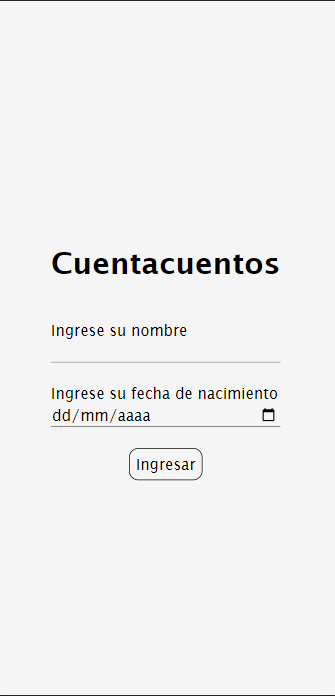
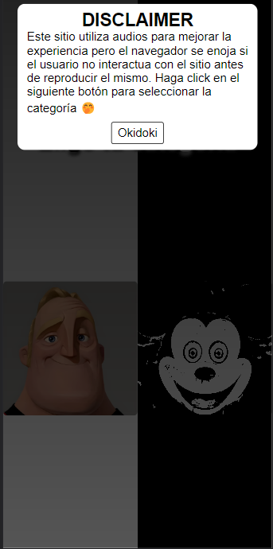
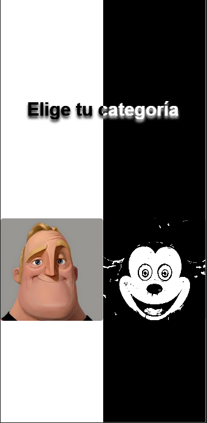
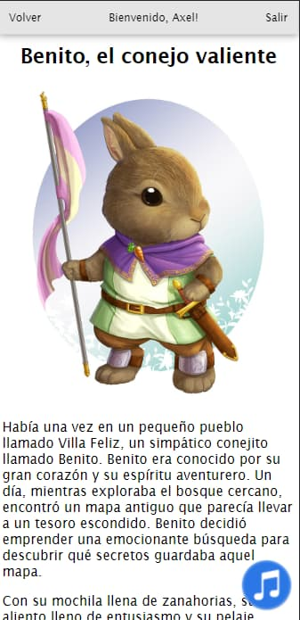

# CuentaCuentos

CuentaCuentos is a simple MPA that allows you to read fully-original stories in a unique way, presenting six tales in two versions for each one: the first version is intended to be readen for all ages and also there's a horror-oriented version of the same story, aimed for adult public. Each of the stories is completely independent of the others, with its own AI-image related to it and only created for the story itself.

## Site - Desktop version

### Landing page

When you enter the website, it will show you a login form, in order to validate that you are 18 years old or older. If not, the horror category will be disabled as it is not targeted for children.

### Categories

Before you can choose the category you want to get in, it shows a disclaimer that warns the user about the usage of audio to improve the reading experience but the browser gets upset if the user does not interact witht the site before.

### Horror menu

When you choose the horror category, you will be redirected to the horror main menu, which displays a cycling banner, a presentation, and six panels related to each of the stories. You must click on the name of a protagonist inside the pictures in order to read a story.

### Tale Structure 

For everyone

Horror Version

In both versions, you have a music button that shows/hides an audio player that contains a music track. The track will be different depending on the story you are in and which category you chose at the beginning:

Now you see me 🤗

Now you don't 😶‍🌫️

## Site - Mobile version
<table>
<tr>
<td>
The Website is compatible with devices of all sizes and all OS's
</td>
</tr>
</table>

## Built with

- HTML
- CSS
- JavaScript

## Team
  | 
---|---
[Lucas Villanueva](https://github.com/KenaiiDev) |[Axel Roitstein](https://github.com/axelroitstein)

